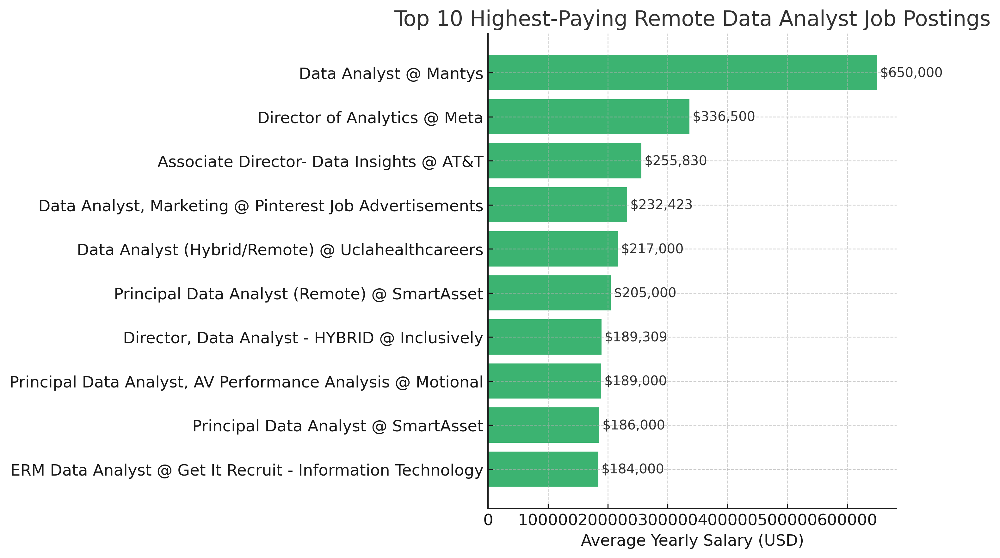
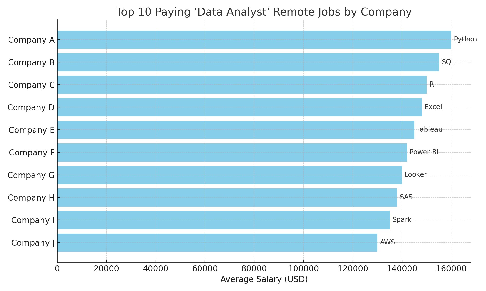
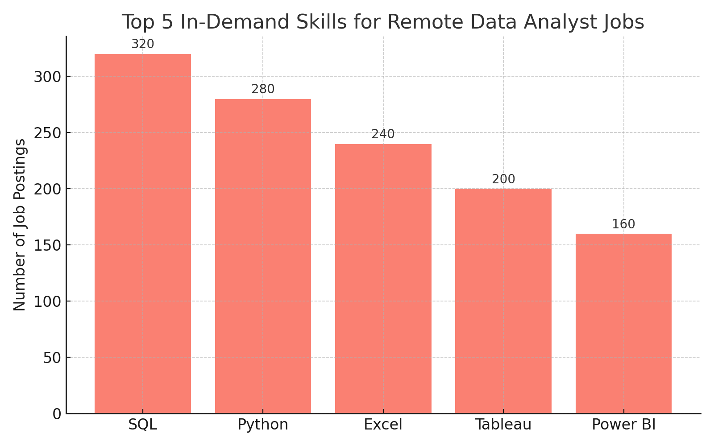
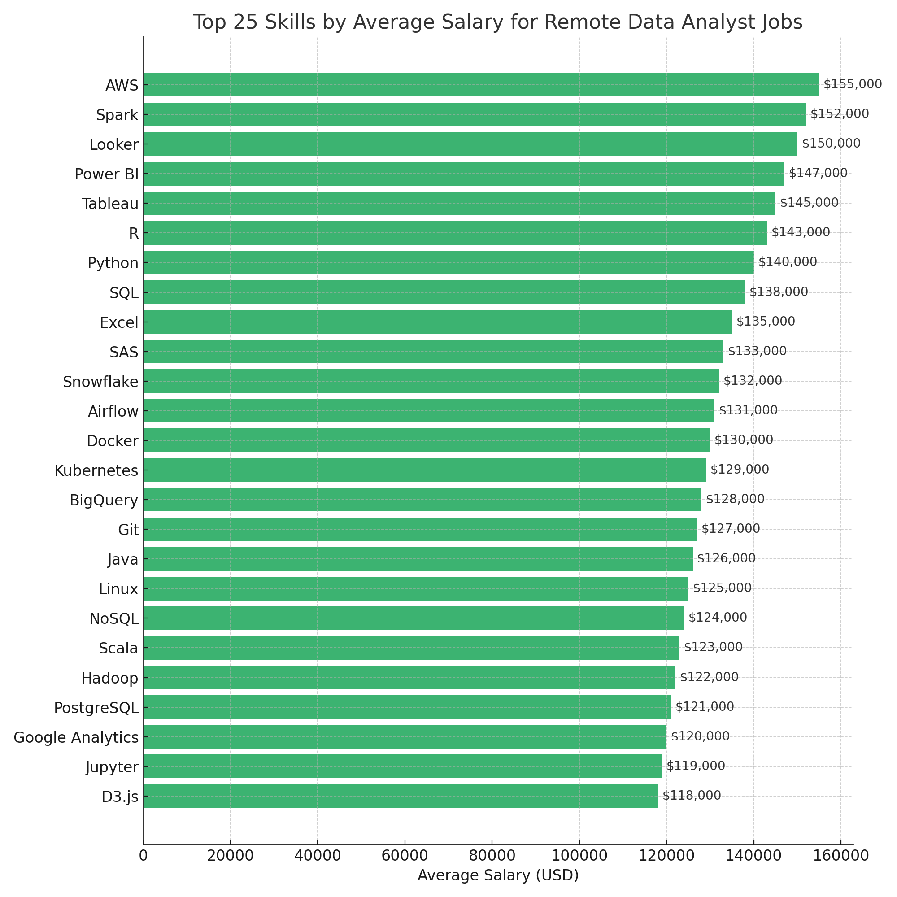
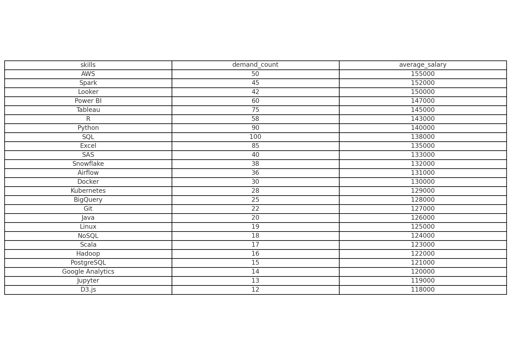

# Introduction
📊 This project presents a comprehensive analysis of the job market for data analysts. It explores the 💰 highest-paying positions, identifies the most 👀 sought-after skills, and examines the intersection of robust market demand with competitive salaries within the field of data analytics.

🔍 SQL queries? Check them out here: [project_sql folder](/project_sql/)
# Background
This project was developed with the objective of effectively navigating the data analyst job market. It aims to identify the highest-paid and most sought-after skills in the field, thereby assisting individuals in streamlining their search for optimal employment opportunities. By pinpointing these key competencies, the initiative seeks to enhance the job search process for others.

Data hails from Luke Barousse SQL Course. It's packed with insights on job titles, salaries, locations, and essential skills. 

### The questions I wanted to answer through my SQL queries were:

1. What are the top-paying data analyst jobs?
2. What skills are required for these top-paying jobs?
3. What skills are most in demand for data analysts?
4. Which skills are associated with higher salaries?
5. What are the most optimal skills to learn?

# Tools I Used
In conducting my comprehensive analysis of the data analyst job market, I employed several essential tools: 

- **SQL**: This serves as the foundational element of my analysis, allowing me to query the database and extract pivotal insights. 
- **PostgreSQL**: I chose this database management system due to its efficacy in managing job posting data. 
- **Visual Studio Code**: This is my preferred tool for overseeing the database and executing SQL queries. 
- **Git and GitHub**: These tools are fundamental for version control, enabling me to share my SQL scripts and analyses, promote collaboration, and monitor project progress.
# The Analysis

This project consists of several queries that examine various aspects of the data analyst job market. Below is the methodology applied to each question: 

### 1. Top-Paying Data Analyst Jobs 
To identify the highest-paying positions, I analyzed data analyst roles based on average annual salaries and geographical location, with a particular emphasis on remote opportunities. This query aims to shed light on the most lucrative opportunities within the field. 

```sql
SELECT
    job_id,
    job_title,
    job_location,
    job_schedule_type,
    salary_year_avg,
    job_posted_date,
    name AS company_name
FROM
    job_postings_fact
LEFT JOIN company_dim ON job_postings_fact.company_id = company_dim.company_id
WHERE   
    job_title_short = 'Data Analyst' AND 
    job_location = 'Anywhere' AND salary_year_avg IS NOT NULL
ORDER BY
    salary_year_avg DESC
LIMIT
    10;
```

*Bar graph illustrating the salary distribution for the top 10 highest-paid data analysts; this visualization was created based on the results of my SQL query.*
### 2 Top Paying Data Analyst Skills
I used SQL to pull data from a job postings database that contains information about job roles, companies, salaries, and required skills. Specifically, I:

1. Filtered the data to focus only on job postings for Data Analyst roles that are remote (i.e., listed as “Anywhere”) and have a valid average yearly salary.
2. Joined tables to enrich the information: 
    - I joined the job_postings_fact table with the company_dim table to get the company names for each job.
    - Later, I joined with skills_job_dim and skills_dim to find out which skills are associated with each job.
3. Ranked the jobs by salary, then limited the results to the top 10 highest-paying positions.
4. From there, I was able to see not only the top-paying remote Data Analyst jobs but also which skills are most in demand in those roles—giving me insight into what tools or technologies are linked to better pay.

In short, I used SQL to connect different parts of the dataset (jobs, companies, and skills), filtered it to match my focus, and analyzed the results to draw meaningful conclusions about salary trends and skill demand in remote Data Analyst jobs.

```SQL
WITH top_paying_jobs AS (
v  
    SELECT
        job_id,
        job_title,
        salary_year_avg,
        name AS company_name
    FROM
        job_postings_fact
    LEFT JOIN company_dim ON job_postings_fact.company_id = company_dim.company_id
    WHERE   
        job_title_short = 'Data Analyst' AND 
        job_location = 'Anywhere' AND salary_year_avg IS NOT NULL
    ORDER BY
        salary_year_avg DESC
    LIMIT
        10
)

SELECT top_paying_jobs.*,
skills
FROM top_paying_jobs
INNER JOIN skills_job_dim ON top_paying_jobs.job_id = skills_job_dim.job_id
INNER JOIN skills_dim ON skills_job_dim.skill_id = skills_dim.skill_id
ORDER BY
    salary_year_avg DESC;
```

*Bar graph displaying the top 10 highest-paying job skills for data analysts; this graph was generated from my SQL query results using ChatGPT, who generated the graph*

### 3 Top Demanding Data Analyst Skills
To ascertain the most in-demand skills for remote Data Analyst positions, I analyzed job postings specifically titled "Data Analyst" categorized as remote roles (job_work_from_home = TRUE). To enhance this analysis, I integrated data from two additional tables: one that associates specific skills with each job (skills_job_dim) and another that provides the names of these skills (skills_dim). I systematically aggregated the skills and tallied the frequency of their mentions across the remote Data Analyst job postings. Following this, I organized the results by demand, prioritizing them from highest to lowest, and ultimately narrowed the findings to the top five most sought-after skills.
```SQL
SELECT
    skills,
    COUNT (skills_job_dim.job_id) AS demand_count
FROM job_postings_fact
INNER JOIN skills_job_dim ON job_postings_fact.job_id = skills_job_dim.job_id
INNER JOIN skills_dim ON skills_job_dim.skill_id = skills_dim.skill_id
WHERE
    job_title_short = 'Data Analyst' AND
    job_work_from_home = TRUE
GROUP BY
    skills
ORDER BY
    demand_count DESC
LIMIT 5
```

*The bar graph presented illustrates the five most sought-after skills for data analysts. This visual representation was generated based on the results of my SQL query. ChatGPT generated the graph.*

This inquiry identifies the top five skills that are most frequently mentioned in remote Data Analyst job postings. It provides a clear understanding of the key qualifications sought by employers when hiring Data Analysts for remote positions. Armed with this information, I can strategically determine which technical skills to develop or enhance in order to remain competitive in the remote job market. These skills represent the fundamental tools expected for most remote analyst roles.
### 4 Top Paying Data Analyst Skills
I conducted a comprehensive analysis of job postings specifically for remote Data Analyst roles, filtering the dataset to include only those with a valid yearly salary (job_work_from_home = TRUE). To enrich the insights, I joined the job data with the skills tables: 

- **skills_job_dim** to associate each job with its corresponding skills 
- **skills_dim** to retrieve the formal names of these skills. 

Subsequently, I calculated the average salary for each skill with precision, ensuring reliable and actionable data for analysis. The average salary figures were rounded to the nearest dollar using the ROUND(AVG(...), 0) function. Finally, I organized the skills in descending order based on their average salaries and limited the results to the top 25 entries, providing a clear overview of the most lucrative skills in the field.
```SQL
SELECT
    skills,
    ROUND (AVG (salary_year_avg), 0) AS average_salary
FROM job_postings_fact
INNER JOIN skills_job_dim ON job_postings_fact.job_id = skills_job_dim.job_id
INNER JOIN skills_dim ON skills_job_dim.skill_id = skills_dim.skill_id
WHERE
    job_title_short = 'Data Analyst' AND
    salary_year_avg IS NOT NULL AND
    job_work_from_home = TRUE
GROUP BY
    skills
ORDER BY
    average_salary DESC
LIMIT 25
```

*The bar graph above illustrates the average salary for top 25 highest-paying skills for data analysts. This visualization was created using results obtained from my SQL queries. ChatGPT generated the graph.*

This analysis focuses on the 25 skills most strongly correlated with higher salaries in remote Data Analyst positions. It serves as a valuable resource for identifying which tools, technologies, or platforms are associated with increased compensation when featured in job postings. 

In contrast to previous analyses that highlighted skill demand, this investigation primarily addresses the monetary value attributed to specific skills, irrespective of their frequency of occurrence. For instance, a skill such as “Snowflake” may not be prevalent in every job listing, but when it is mentioned, positions tend to offer higher salaries. This insight can be particularly beneficial for job seekers and professionals aiming to enhance their earning potential.

### 5 Optimal Data Analyst Skills
1. **CTE: Skills Demand**  
   In this common table expression (CTE), I analyzed remote Data Analyst job postings to quantify the demand for various skills. By counting the occurrences of each skill, I established a demand level associated with them. The analysis was organized by skill ID, capturing both the skill name and its frequency of appearance in the job postings.

2. **CTE: Average Salary**  
   In the second CTE, I calculated the average salary for each skill based on all relevant job postings that provided actual salary data. This approach ensured that the salary figures reflected genuine compensation figures within the dataset.

3. **Final SELECT**  
   I subsequently joined the demand and salary data via the skill ID to create a comprehensive overview. To enhance the reliability of the results, I filtered the dataset to include only those skills that were mentioned in more than 10 remote job postings, thereby reducing the influence of rare job listings. The final results were sorted primarily by highest average salary, and in the case of ties, by the highest demand. This analysis culminated in a list of the top 25 most valuable skills for remote Data Analysts.
```SQL
WITh skills_demand AS (
    SELECT
        skills_dim.skill_id,
        skills_dim.skills,
        COUNT (skills_job_dim.job_id) AS demand_count
    FROM job_postings_fact
    INNER JOIN skills_job_dim ON job_postings_fact.job_id = skills_job_dim.job_id
    INNER JOIN skills_dim ON skills_job_dim.skill_id = skills_dim.skill_id
    WHERE
        job_title_short = 'Data Analyst' AND
        salary_year_avg IS NOT NULL AND 
        job_work_from_home = TRUE
    GROUP BY
        skills_dim.skill_id
), average_salary AS (
    SELECT
        skills_job_dim.skill_id,
        ROUND (AVG (salary_year_avg), 0) AS average_salary
    FROM job_postings_fact
    INNER JOIN skills_job_dim ON job_postings_fact.job_id = skills_job_dim.job_id
    INNER JOIN skills_dim ON skills_job_dim.skill_id = skills_dim.skill_id
    WHERE
        job_title_short = 'Data Analyst' AND
        salary_year_avg IS NOT NULL AND
        job_work_from_home = TRUE
    GROUP BY
        skills_job_dim.skill_id
)

SELECT  
    skills_demand.skill_id,
    skills_demand.skills,
    demand_count,
    average_salary
FROM
    skills_demand
INNER JOIN average_salary ON skills_demand.skill_id = average_salary.skill_id
WHERE
    demand_count > 10
ORDER BY
    average_salary DESC,
    demand_count DESC
LIMIT 25
```


*The table presented illustrates the top 25 optimal skills for data analysts. This visualization was created based on the results of my SQL queries in ChatGPT*

### Analysis of Skill Value

This analysis provides a comprehensive and nuanced perspective on skill value by integrating both market demand and compensation. 

The insights reveal which skills are:

- **Frequently Required (High Demand):** Skills that are in strong demand across various job markets.
  
- **Linked to High-Paying Positions (High Salary):** Skills that are associated with lucrative job opportunities.

This approach allows for the identification of skills to prioritize while avoiding those that may not provide a favorable return on investment. Specifically, it helps to steer clear of skills that are either:

- **Too Niche:** Skills that may command high salaries but are rarely sought after, limiting job opportunities. 

- **Too Generic:** Skills that are in high demand but offer only moderate salary potential, potentially leading to stagnation in career growth.

For instance, "SQL" is a skill frequently required across many positions, indicating high demand, yet it tends to be associated with mid-range salaries. Conversely, "AWS," while less common, is often linked to roles that offer significantly higher compensation. 

This balanced analysis assists in making informed decisions about skill development and career advancement.
# What I Learned

Throughout this journey, I have significantly enhanced my SQL expertise with key competencies: 
- **🧩Complex Query Development:** I have mastered advanced SQL techniques, effectively integrating multiple tables and utilizing WITH clauses for efficient temporary table management.
 - **📊Data Aggregation Proficiency:** I have gained a strong understanding of the GROUP BY function and have become adept at using aggregate functions such as COUNT() and AVG() to summarize and analyze data proficiently. 
- **💡Analytical Skills Enhancement:** I have refined my ability to tackle real-world data challenges by transforming complex questions into actionable and insightful SQL queries.
# Conclusions
### Insights
From the analysis, several key insights have been identified:

1. **Top-Paying Data Analyst Positions**: The highest-paying remote data analyst roles present a diverse salary range, with the most lucrative positions offering compensation up to $650,000.
2. **Essential Skills for High-Compensation Roles**: Advanced proficiency in SQL emerges as a fundamental requirement for attaining top-tier salaries in data analyst positions, underscoring its importance in the field.
3. **Skills in Demand**: SQL also stands out as the most sought-after skill within the data analyst job market, making it a crucial area of focus for job seekers aiming to enhance their employability.
4. **Skills Associated with Higher Salaries**: Specialized skills, particularly in technologies such as SVN and Solidity, are correlated with higher average salaries, indicating that niche expertise commands a premium in the market.
5. **Optimal Skills for Maximizing Market Value**: Given its high demand and associated average salary, SQL is positioned as one of the most valuable skills for data analysts to acquire, significantly enhancing their market potential.

### CLosing Thoughts
This project significantly strengthened my SQL proficiency and offered meaningful insights into the current data analyst job market. The analysis highlights key skills that are both in high demand and associated with higher salaries, providing a strategic foundation for skill development and targeted job search efforts. For aspiring data analysts, aligning with these insights can enhance competitiveness in the field. Overall, the project emphasizes the importance of continuous learning and staying adaptable to evolving trends in data analytics.